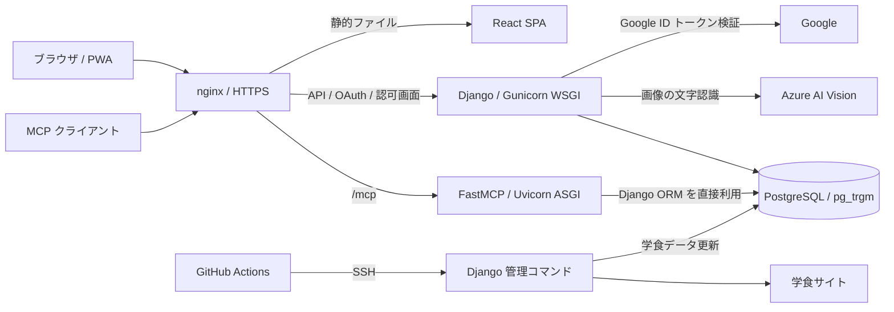
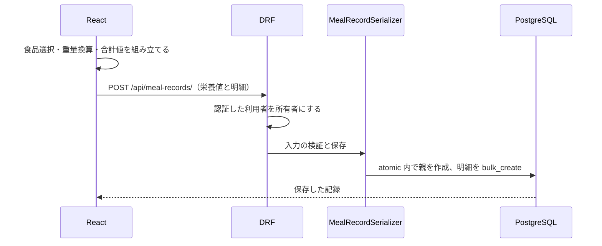

# アーキテクチャ

[ドキュメント一覧](README.md) / [データ設計](data-model.md) / [設計判断](decisions.md)

DishBoard は食事・体重・栄養目標を記録する PWA である。研究室の10〜20名が利用する規模と、
1GB メモリの VM での運用を前提に、Django の単一アプリと PostgreSQL を中心に構成する。
Web、MCP、管理コマンドは同じモデルと処理を共有する。独立したマイクロサービス群ではない。

## 実行時の構成

PWA と `/api/` は同一オリジンから配信する。OAuth のログイン・同意画面は別の認可用オリジンを使う。
同じ nginx と Django で受けるが、PWA に認可リンクが横取りされる問題を避けるためホストを分けている
（ADR #10・#26）。[認証の詳細](google-authentication.md)を参照。

| サービス | 開発 | 本番 |
|---|---|---|
| `db` | PostgreSQL 16、ホストの5432番へ公開 | PostgreSQL 16、Compose 内のみ |
| `backend` | Django runserver、8000番 | Gunicorn、nginx 経由 |
| `mcp` | Uvicorn、8001番、コード変更時に再読込 | Uvicorn 1ワーカー、nginx 経由 |
| フロント配信 | `frontend` の Vite、5173番 | `nginx` イメージにビルド済み SPA を同梱 |

定義は [開発 Compose](../docker-compose.yml)、[本番 Compose](../docker-compose.production.yml)、
[backend Dockerfile](../backend/Dockerfile)、[frontend Dockerfile](../frontend/Dockerfile)。
本番の nginx 設定は [テンプレート](../nginx/templates/dishboard.conf.template)から生成する。
生成先の `nginx/conf.d/` を設定の正本にはしない。

## 技術と選択の理由

| 領域 | 採用技術 | このプロジェクトでの使い方 |
|---|---|---|
| Web API | Python 3.12 / Django 5.2 / DRF 3.16 | ORM・認証・管理画面・トランザクションを同じ基盤で扱う |
| DB | PostgreSQL 16 / pg_trgm | 利用者別データ、制約、集計、食品名の候補検索 |
| MCP | Python MCP SDK / django-oauth-toolkit / Uvicorn | ORM と既存のサービスを直接利用する別プロセス |
| UI | React 19 / TypeScript / Vite / Tailwind CSS v4 | 機能別の構成、型検査、ビルド時の静的生成 |
| UI 部品 | shadcn/ui / Radix UI / recharts / sonner | 操作部品、グラフ、通知 |
| PWA | vite-plugin-pwa / Workbox | アプリの起動資産と一部 GET 応答をキャッシュ |
| 外部処理 | Azure AI Vision / GitHub Actions | OCR と定期実行を VM の常駐ワーカーから分離 |

依存バージョンの正本は [requirements.txt](../backend/requirements.txt)、
[package.json](../frontend/package.json)、[package-lock.json](../frontend/package-lock.json)。
表は採用構成を説明するもので、最新バージョンの推奨表ではない。

Redis・Celery は使用しない。学食更新は管理コマンドを外部から呼ぶため、キューとワーカーの運用が不要になる。
その代わり、OCR はリクエスト中に外部サービスの完了を待つ。大量の非同期処理向けの構成ではない（ADR #9）。

MCP は同じ backend のビルド定義を使い、起動コマンドだけを変える。Web API を内部 HTTP で呼ばず、
Django を import することで内部用認証を増やさない。反面、MCP は Django のモデルや設定に依存し、
単独の別製品としてはデプロイできない（ADR #22・#23）。ADR #22 のメモリ実測は導入時の値であり、
現在の負荷や利用者増加時の容量保証ではない。

## コードの責務

| 場所 | 責務と読みどころ |
|---|---|
| [record_app/urls.py](../backend/record_app/urls.py) | Web API の入口を確定する |
| [views.py](../backend/record_app/views.py) | HTTP の検証・応答、認証、利用者別の取得範囲 |
| [serializers.py](../backend/record_app/serializers.py) | 値の検証、出力形、食事・Myメニューのネスト保存 |
| [services.py](../backend/record_app/services.py) | Myメニューからの食事作成、体重の登録、再送キー付き作成 |
| [business_logic](../backend/record_app/business_logic) | 栄養計算・検索・OCR・学食取得と提案。HTTP request/Response に依存しない |
| [models.py](../backend/record_app/models.py) | 保存形式、一意制約、外部キー、インデックス |
| [mcp_server](../backend/mcp_server) | トークン検証、スコープ確認、入力変換、ツール登録 |
| [management/commands](../backend/record_app/management/commands) | CSV 取り込みと学食更新の実行入口 |

これは責務の分離であり、全リクエストが `views → services → business_logic` の順に通るわけではない。
単純な CRUD は ViewSet と serializer、集計は business_logic、複数操作は service を使う。
business_logic は ORM や外部 API を利用するため、すべてが副作用のない純粋関数という意味でもない。
ネスト保存のトランザクションは serializer、再送防止やテンプレートからの作成は service にある。

## 食事記録の保存経路

Web の通常登録は入力された栄養値を保存する。MCP は `item_type`・`item_id`・分量を受け取り、
サーバーで食品を解決・換算してから同じ serializer へ渡す。
重量不明のMyアイテムは1食分の栄養値を食数で掛け、食品・食事・Myメニューの全経路で重量をnullのまま保持する。
したがって「すべての入口で栄養値をサーバー再計算する」とは説明しない。
入力契約の差は [Web API](api.md)、保存の意味は [データ設計](data-model.md)にまとめる。

MCP の関数は [tools.py](../backend/mcp_server/tools.py) に定義し、[server.py](../backend/mcp_server/server.py)
で登録する。非同期の入口から同期 ORM を `sync_to_async` で呼び、Django の初期化は
[asgi.py](../backend/mcp_server/asgi.py) で行う。通信はステートレスな Streamable HTTP と JSON 応答を使う。
参照スコープと書き込みスコープを区別し、保存時の確認・再送・削除の契約は [MCP 仕様](mcp.md)に集約する。

## 外部データの流れ

| 処理 | 流れ | 保存への影響 |
|---|---|---|
| 標準食品 | 同梱 CSV → 成分識別子による列解決 → 食品番号で更新 | 食品の既存 ID を維持。記録のスナップショットは変更しない |
| OCR | 撮影・切り抜き → 一時画像 → Azure の認識結果 → 栄養素抽出 → 確認画面 | 読み取っただけでは食事や食品を保存しない。一時画像は処理後に削除 |
| 学食更新 | Actions の定期実行 → SSH → 管理コマンド → 3食堂の取得 → マスタ入替 | 学食マスタの DB ID は維持しない。過去の記録はコピーした値を保持 |
| 学食提案 | サーバーの目標値 − 当日の摂取量 → 候補を採点 | 読み取りだけ。利用者に代わって食事を登録しない |

OCR の PFC とエネルギーの整合性チェックは確認を促すための補助であり、食品成分表全件を拒否する条件ではない。
食品データの欠測や単位の例外は [データ設計](data-model.md)を参照。

## フロントエンドの状態と画面

[src/features](../frontend/src/features) を機能単位に分け、機能外への公開は `index.ts` を経由する。
入力中の明細と合計は `useMenuBuilder`、サーバーデータ取得は `useDashboardData`、
目標値は `useGoalSettings` が扱う。HTTP 通信は [lib/axios.ts](../frontend/src/lib/axios.ts) に集める。

React Router・Redux・Zustand は使っていない。画面切替は React の state、設定の共有は props で足りる範囲に留める
（ADR #11〜#13）。URL ごとの画面復元やブラウザの戻る操作に対応する設計ではない。
入力途中を保持する食事・体重のモード切替では、両フォームをマウントしたまま表示だけ切り替える（ADR #35）。

テーマ・栄養目標のキャッシュ・DRF Token は localStorage を使う。栄養目標の正本はサーバーであり、
オフライン中に変更した目標を再接続時に自動送信する仕組みはない。

PWA の [Vite 設定](../frontend/vite.config.js)では API の GET を NetworkFirst で扱う。
アプリをオフラインで起動できても、食事作成・OCR・ログインがオフラインで完了するわけではない。
書き込みの送信待ちキューは実装していない。キャッシュは認証境界の代替ではなく、
共有端末・利用者切替時の扱いは別途検証が必要になる。

## 制約と保守

個人データの分離は Web の利用者別 queryset と MCP の `resolve_user()` 後の利用者別クエリで行う。
DB の行レベルセキュリティを導入した構成ではない。入口追加時も他利用者の ID を取得できないことをテストする。

MCP の書き込み制限は利用者ごとに60秒20件、プロセス内メモリで管理する。
複数ワーカー・複数 VM に増やす場合は制限状態の共有を再設計する必要がある。
Web API の認証系スロットリングとは別の仕組みである。

型・テスト・実行方法は [開発手順](development.md)、本番のデータ更新順序は [運用手順](operations.md)、
受容している制約と未解決事項は [ADR](decisions.md)で確認する。
