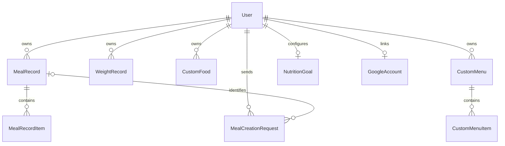

# データ設計と栄養値

[ドキュメント一覧](README.md) / [アーキテクチャ](architecture.md) / [MCP](mcp.md)

モデルの正本は [models.py](../backend/record_app/models.py)、履歴は
[migrations](../backend/record_app/migrations)。以下は主要な関係と、更新時に守る意味を説明する。

## 所有者とモデルの関係

`StandardFood` と `CafeteriaMenu` は全利用者共通のマスタで、利用者への外部キーを持たない。
DRF Token・セッション・OAuth のテーブルは各認証ライブラリが管理する。

| モデル | 内容 | 主な制約・ライフサイクル |
|---|---|---|
| `MealRecord` | 日付・食事タイミング・名前・12栄養素の合計 | 同じ日・タイミングに複数登録できる |
| `MealRecordItem` | 食品名、分量、参照元の種別と ID、12栄養素 | 親の削除で明細も削除。表示順を保存 |
| `WeightRecord` | 日付と kg | `(user, record_date)` が一意。同日の登録は上書き |
| `StandardFood` | 食品番号、名前、分類、100g当たりの栄養値 | `food_number` が一意。再取り込みはこの番号で更新 |
| `CustomFood` | 個人の食品、100g当たりの栄養値、出典・表示基準 | `(user, name)` が一意。1食基準なら正の1食分重量が必須 |
| `CafeteriaMenu` | 食堂、提供元のメニュー ID、区分、1食分の栄養値 | `(cafeteria, menu_id)` が一意。週次更新でマスタを入替 |
| `CustomMenu` / `CustomMenuItem` | 再利用する明細と合計 | 明細の作成・変更時に `total_*` を再集計 |
| `NutritionGoal` | 1日当たりの kcal・PFC 目標 | 利用者と1対1。未設定時はモデルの既定値を返す |
| `GoogleAccount` | Google の subject とローカル利用者の対応 | subject が一意、利用者と1対1。メール一致で自動連携しない |
| `MealCreationRequest` | UUID、入力ハッシュ、作成した食事への参照 | `(user, key)` が一意。食事削除時は参照だけ NULL にする |

Google 連携の識別方法と解除条件は [認証仕様](google-authentication.md)に記載する。

## 記録をスナップショットにする

食事と Myメニューの明細は、参照先食品への外部キーを持たず、
`item_type`・`item_id`・`item_name` と栄養値をコピーして保存する。
この `item_id` は食品マスタとの参照整合性を DB が保証する外部キーではない。

マスタや Myアイテムの変更・削除で過去の記録が変わらないことを優先した設計である（ADR #1）。
学食マスタの入替後も明細は表示できるが、古い ID で現在のマスタを引き直せるとは限らない。
MCP で記録の明細を更新するときは、現在の検索結果の ID を使い、栄養値を再計算する。
Web の明細更新は送信した値を保存する。どちらも `items` を指定した更新では明細を全置換する。

親と明細の保存・全置換は `transaction.atomic` 内で行う。
`CustomMenu.total_*` は保存時に DB の `Sum` で集計する。
`MealRecord` の合計値は Web では入力値、MCP では解決した明細の合計が渡される。
DB の生成列やトリガーが常に合計を保証する設計ではない。

## 栄養基準と単位

| 場所 | 栄養基準 | ナトリウム |
|---|---|---|
| 標準食品の `*_per_100g` | 100g当たり | mg |
| Myアイテムの `*_per_100g` | 表示基準にかかわらず100g当たり | mg |
| 学食マスタの DB | 1食当たり | **`sodium` に食塩相当量gを保持** |
| 学食の Web / MCP 応答 | 1食当たり | `食塩相当量 × 1000 / 2.54` により mg に変換 |
| 食事・Myメニューの新規明細 | 記録した分量の実数値 | mg |

その他の単位はエネルギーが kcal、PFC・食物繊維が g、ビタミンAが µg、
カルシウム・鉄・ビタミンB1/B2/Cが mg。命名上、マスタの `carbs_per_100g` は記録の
`carbohydrates`、`fiber_per_100g` は `dietary_fiber` に対応する（ADR #17・#37）。
一部モデルの表示ラベルには旧単位の表記が残るため、`verbose_name` だけで変換を判断しない。
換算の正本は [nutrition_units.py](../backend/record_app/business_logic/nutrition_units.py) と
[対応表](../backend/record_app/business_logic/custom_food.py)。

Myアイテムの `nutrition_basis=per_serving` は入力・MCP出力の基準を表す。
例として1食28g・117kcalなら、DB は `117 × 100 / 28` kcal/100g を保持する。
MCP の `servings=2` は56g・234kcalに換算する。Web API の `*_per_100g` は常に100g基準である。
表示と保存の基準を混同して二重換算しない（ADR #40）。

同梱CSVの欠測・微量表記と、Myアイテム作成で省略された微量栄養素は0として扱う。
測定された0と未取得を区別するモデルではない。旧データには修正前の単位や列対応による値が残り得る。
食品再投入で過去の記録を一括補正することはない。

## 再送と削除

MCP の食事作成で UUID を受け取ると、利用者行をロックし、入力ハッシュと食事への参照を
食事と同じトランザクションで保存する。同じキー・同じ入力の再送は既存記録を返す。
入力を変えた再送、削除済み記録の再作成は拒否する。キーの省略時には重複防止を保証しない。

キーは食事を削除しても残し、利用者削除時に削除する。一般的な操作監査ログではなく、
入口・編集履歴・削除理由を網羅的に記録するものではない（ADR #41）。

## クエリとインデックス

食事・体重は利用者と日付、Myアイテムは利用者と名前、明細は親と表示順の索引を持つ。
食事一覧は明細の件数だけを `Count` で取得し、詳細は `prefetch_related('items')` で取得する。
Myメニュー一覧は prefetch 済み明細の長さを使い、件数だけの追加クエリを避ける。

標準食品名には pg_trgm の GIN 索引を定義するが、`TrigramSimilarity` の関数値で絞るだけでは
その索引利用を保証できない。索引が存在することと、実行計画で使われることを区別する。
MCP 検索の正規化・候補補完・学食集約は [MCP仕様](mcp.md)を参照。
